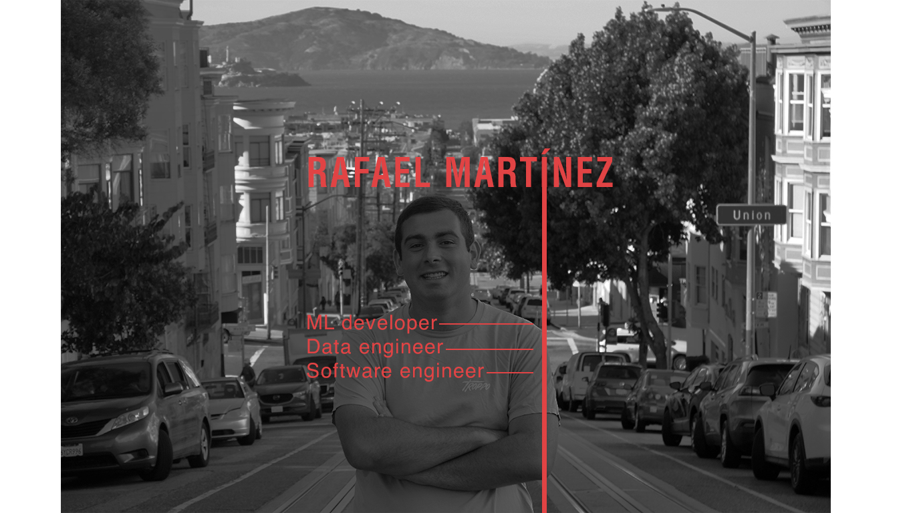

# Rafael Martínez Quiles - Personal Website
Welcome to my personal website! This platform serves as a hub to showcase my professional journey, projects, research, and contact details. Below, you'll find an outline of the key sections that the website will host. Each section will be designed with simplicity and professionalism in mind, along with interactive elements for easy navigation.

## Sections Overview

### About Me
In this section, you'll learn more about my background, education, and passion for technology. I'll share details about my professional journey, academic pursuits, and the skills I've acquired along the way.

### Experience
This section highlights my work experience and the roles I’ve held in various companies. Each job will be accompanied by:
- **A brief description** of my responsibilities and achievements.
- **A link** to the companies where I’ve worked, allowing you to explore their websites for more information.

### Portfolio
The portfolio section will feature pictures representing my key projects. Each project image is interactive—clicking on it will redirect you to the corresponding GitHub repository where you can explore the code and further details. This section is a visual representation of my work in machine learning, AI, and more.

### Research
Here, I'll share articles and posts I’ve published or reviewed. This section will include:
- **Posts from LinkedIn** related to my research.
- **Published articles reviews** from platforms like IEEE.

### Contact
This section contains my contact details, including:
- **Location:** San Francisco, California
- **Phone number:** +1 628-333-0162
- **Email:** rafaelmartinezquiles@gmail.com
Feel free to reach out if you have any inquiries or professional opportunities to discuss.

### Social Links
Stay connected with me on platforms like GitHub, LinkedIn and Instagram.

Thank you for visiting my website! I hope you find it insightful and engaging. Feel free to explore my projects, research, and experiences, and don’t hesitate to get in touch!
